# Documento de Requisitos do Sistema PetVital (MVP)

## 1. Introdução

Este documento formaliza os requisitos de negócio, funcionais e não funcionais para o desenvolvimento do **PetVital**, um sistema de gestão veterinária moderno, baseado em arquitetura **Multi-Inquilino (SaaS)**, focado em clínicas e veterinários autônomos.

O objetivo é fornecer uma ferramenta robusta que centralize o gerenciamento de pacientes, prontuários, agendamentos, estoque e comunicação, garantindo a rastreabilidade e a conformidade com as melhores práticas clínicas e de segurança de dados.

---

## 2. Definição de Regras de Negócio (DRN)

As regras de negócio (RN) definem as políticas e restrições que governam o sistema, garantindo a integridade dos dados e a conformidade com os processos clínicos.

### 2.1. Regras de Multitenancy e Acesso

| ID | Regra de Negócio | Detalhes |
| :--- | :--- | :--- |
| **RN001** | **Isolamento de Dados (Multitenancy)** | Nenhum usuário de uma clínica (Tenant) pode acessar, visualizar ou modificar dados pertencentes a outra clínica. O filtro por `clinica_id` deve ser aplicado em todas as consultas transacionais. |
| **RN002** | **Tipos de Inquilino** | A entidade principal (`clinica`) deve suportar dois tipos de inquilino: **PJ** (Pessoa Jurídica - Clínica) e **PF** (Pessoa Física - Veterinário Autônomo). |
| **RN003** | **Identificação Fiscal** | Para inquilinos PJ, o campo `documento_fiscal` deve ser um CNPJ válido. Para inquilinos PF, deve ser um CPF válido. Ambos devem ser únicos no sistema. |
| **RN004** | **Controle de Acesso** | O acesso ao sistema deve ser controlado por perfis (`ADMIN`, `VETERINARIO`, `RECEPCAO`, `AUXILIAR`, `FINANCEIRO`), e as permissões devem ser aplicadas estritamente (Ex: Apenas `VETERINARIO` pode emitir receitas). |

### 2.2. Regras de Prontuário e Histórico Clínico

| ID | Regra de Negócio | Detalhes |
| :--- | :--- | :--- |
| **RN005** | **Vínculo Tutor-Animal** | Todo `animal` deve estar vinculado a pelo menos um `tutor` principal. Um animal pode ter múltiplos tutores secundários (relacionamento N:N). |
| **RN006** | **Imutabilidade do Prontuário** | Após a criação, o registro de uma `consulta` (prontuário) não pode ser excluído. Qualquer alteração deve gerar um novo registro na tabela `consulta_historico`, mantendo a versão anterior intacta para fins de auditoria. |
| **RN007** | **Registro de Peso** | O registro de peso (`peso_historico`) deve ser sempre associado a um `animal` e incluir a Escala de Condição Corporal (ECC). |
| **RN008** | **Prescrição por Veterinário** | A emissão de uma `prescricao` deve ser obrigatoriamente vinculada a um `usuario` com o perfil `VETERINARIO`. |

### 2.3. Regras de Comunicação e Agendamento

| ID | Regra de Negócio | Detalhes |
| :--- | :--- | :--- |
| **RN009** | **Lembrete de Vacina** | O sistema deve calcular a data de envio do lembrete de reforço subtraindo os dias de antecedência configurados (na tabela `configuracao`) da `data_proximo_reforco` registrada na `vacina_aplicada`. |
| **RN010** | **Consentimento de Comunicação** | Mensagens de saúde e segurança (Ex: Lembretes de vacina, retorno) são obrigatórias e serão sempre enviadas. Mensagens informativas/promocionais (Massa) só podem ser enviadas se a flag `aceita_comunicacao_informativa` do `tutor` estiver marcada como `TRUE`. |
| **RN011** | **Rastreabilidade de Mensagens** | Todo envio de mensagem (automática ou em massa) deve ser registrado na tabela `comunicacao_historico`, incluindo o conteúdo e o status de envio. |
| **RN012** | **Registro de Vacina** | O registro de uma `vacina_aplicada` é um ato clínico e não exige vínculo obrigatório com o estoque, permitindo o uso por veterinários autônomos. |

### 2.4. Regras de Segurança e Privacidade (Multitenancy e LGPD)

| ID | Regra de Negócio | Detalhes |
| :--- | :--- | :--- |
| **RN013** | **Políticas de RLS no Banco de Dados** | O PostgreSQL deve impor Row Level Security (RLS) em todas as tabelas transacionais que possuem a coluna `clinica_id`, impedindo o vazamento de dados acidental entre inquilinos na base. |
| **RN014** | **Criptografia de Credenciais de Terceiros** | O campo `whatsapp_api_token` da tabela `clinica` e quaisquer outros tokens confidenciais devem ser armazenados criptografados usando criptografia AES-256-GCM a nível de aplicação. |
| **RN015** | **Chave de Criptografia Externa** | A chave simétrica para encriptação dos segredos dos inquilinos deve ser injetada na inicialização do Spring Boot através de variáveis de ambiente do sistema operacional, sem custos com cofres de chaves externos. |
| **RN016** | **Imutabilidade e Restrições de Log** | Não devem existir rotas/funcionalidades de alteração ou exclusão nas tabelas `auditoria_log` e `consulta_historico`. Devem ser aplicadas triggers no banco de dados para impedir `UPDATE` ou `DELETE` nestes registros. |
| **RN017** | **Acesso Restrito a Arquivos Anexos** | Arquivos carregados na tabela `anexo` devem ser armazenados de maneira totalmente privada. O acesso deve ser intermediado pela aplicação através de URLs assinadas temporárias gratuitas (ex: Supabase Storage) ou controllers Spring Boot que validem as permissões de acesso ao arquivo local. |

---

## 2.5. Regras de Comercialização e Operação da Plataforma SaaS

As regras abaixo complementam o MVP do PetVital, permitindo sua utilização comercial em ambiente SaaS multi-inquilino.

### 2.5.1. Regras de Assinatura e Cobrança

| ID | Regra de Negócio | Detalhes |
| :--- | :--- | :--- |
| **RN018** | **Plano Obrigatório** | Toda clínica deve possuir uma assinatura ativa associada a um plano para utilizar o sistema. |
| **RN019** | **Período de Teste (Trial)** | Novas clínicas poderão receber um período de avaliação gratuito configurável em dias. |
| **RN020** | **Bloqueio por Inadimplência** | Clínicas com assinaturas vencidas além do prazo de tolerância deverão ter o acesso bloqueado automaticamente. |
| **RN021** | **Preservação de Dados** | O bloqueio da assinatura não poderá excluir ou alterar dados da clínica. O acesso apenas ficará indisponível até a regularização. |
| **RN022** | **Histórico Financeiro de Assinaturas** | Todas as cobranças, pagamentos, cancelamentos e alterações de plano deverão ser registrados para auditoria. |
| **RN023** | **Mudança de Plano** | O sistema deverá permitir upgrade ou downgrade de plano sem perda de dados. |
| **RN024** | **Limites por Plano** | Cada plano poderá possuir restrições configuráveis de usuários, armazenamento, envios de mensagens ou outras funcionalidades. |
| **RN025** | **Cancelamento da Assinatura** | O cancelamento não poderá remover dados da clínica. Os registros deverão permanecer armazenados pelo período definido na política da plataforma. |

### 2.5.2. Regras de Administração Global da Plataforma

| ID | Regra de Negócio | Detalhes |
| :--- | :--- | :--- |
| **RN026** | **Perfil Super Administrador** | O sistema deverá possuir o perfil `SUPER_ADMIN`, responsável pela administração global da plataforma SaaS. |
| **RN027** | **Acesso Global Restrito** | Apenas usuários com perfil `SUPER_ADMIN` poderão visualizar informações de todas as clínicas. |
| **RN028** | **Gerenciamento de Clínicas** | O Super Administrador poderá ativar, desativar, bloquear ou liberar clínicas. |
| **RN029** | **Monitoramento da Plataforma** | O painel administrativo deverá exibir métricas globais de utilização da plataforma. |
| **RN030** | **Auditoria Administrativa** | Todas as ações realizadas por Super Administradores deverão ser registradas em auditoria específica. |

### 2.5.3. Regras de Recuperação de Senha

| ID | Regra de Negócio | Detalhes |
| :--- | :--- | :--- |
| **RN031** | **Solicitação de Recuperação** | Usuários poderão solicitar recuperação de senha utilizando o e-mail cadastrado. |
| **RN032** | **Token Temporário** | O sistema deverá gerar token único e temporário para redefinição da senha. |
| **RN033** | **Expiração de Token** | Tokens expirados não poderão ser reutilizados. |
| **RN034** | **Uso Único** | Após utilização, o token deverá ser invalidado imediatamente. |
| **RN035** | **Registro de Evento** | Solicitações de recuperação e redefinições deverão ser registradas para fins de segurança. |

### 2.5.4. Regras de Monitoramento e Logs de Erro

| ID | Regra de Negócio | Detalhes |
| :--- | :--- | :--- |
| **RN036** | **Registro de Exceções** | Toda exceção não tratada deverá ser registrada em log centralizado. |
| **RN037** | **Rastreabilidade de Erros** | O log deverá conter data, usuário, endpoint, tenant e detalhes técnicos do erro. |
| **RN038** | **Preservação de Evidências** | Logs de erro não poderão ser alterados manualmente pela aplicação. |
| **RN039** | **Monitoramento de Integrações** | Falhas em integrações externas deverão possuir registro detalhado. |
| **RN040** | **Notificação de Falhas Críticas** | Erros classificados como críticos deverão gerar alertas automáticos para administradores da plataforma. |

### 2.5.5. Regras de Backup e Recuperação

| ID | Regra de Negócio | Detalhes |
| :--- | :--- | :--- |
| **RN041** | **Backup Automático** | O sistema deverá executar backups automáticos periódicos do banco de dados. |
| **RN042** | **Retenção de Backups** | Os backups deverão ser armazenados por período configurável. |
| **RN043** | **Recuperação de Dados** | A plataforma deverá possuir procedimento documentado de restauração. |
| **RN044** | **Proteção Contra Exclusões Acidentais** | Dados removidos deverão permanecer recuperáveis durante período de retenção definido. |
| **RN045** | **Validação de Integridade** | Os backups deverão ser validados periodicamente para garantir recuperação consistente. |

### 2.5.6. Regras de Dashboard Gerencial

| ID | Regra de Negócio | Detalhes |
| :--- | :--- | :--- |
| **RN046** | **Indicadores Operacionais** | O dashboard deverá exibir indicadores operacionais relevantes para a clínica. |
| **RN047** | **Indicadores Financeiros** | O dashboard deverá apresentar métricas financeiras consolidadas. |
| **RN048** | **Informações em Tempo Real** | Os indicadores deverão refletir os dados mais recentes disponíveis. |
| **RN049** | **Personalização** | Clínicas poderão habilitar ou ocultar widgets específicos. |
| **RN050** | **Acesso por Perfil** | Os indicadores exibidos deverão respeitar as permissões do usuário. |

### 2.5.7. Regras de Controle de Caixa

| ID | Regra de Negócio | Detalhes |
| :--- | :--- | :--- |
| **RN051** | **Movimentação Financeira** | O sistema deverá registrar entradas e saídas financeiras da clínica. |
| **RN052** | **Fechamento Diário** | O caixa poderá ser fechado diariamente por usuário autorizado. |
| **RN053** | **Rastreabilidade** | Toda movimentação deverá registrar usuário responsável, data e motivo. |
| **RN054** | **Conciliação Financeira** | Os registros financeiros deverão permitir conferência com pagamentos registrados. |
| **RN055** | **Imutabilidade de Fechamentos** | Fechamentos concluídos não poderão ser alterados sem autorização administrativa. |

### 2.5.8. Regras de Serviços Prestados

| ID | Regra de Negócio | Detalhes |
| :--- | :--- | :--- |
| **RN056** | **Cadastro de Serviços** | O sistema deverá permitir cadastro de serviços prestados pela clínica. |
| **RN057** | **Precificação Individual** | Cada serviço deverá possuir valor configurável. |
| **RN058** | **Ativação e Inativação** | Serviços poderão ser ativados ou desativados sem exclusão histórica. |
| **RN059** | **Vinculação Financeira** | Serviços executados poderão gerar faturamento automaticamente. |
| **RN060** | **Histórico de Execução** | O sistema deverá manter histórico completo dos serviços realizados. |

### 2.5.9. Regras de Emissão de Documentos PDF

| ID | Regra de Negócio | Detalhes |
| :--- | :--- | :--- |
| **RN061** | **Geração de PDF** | O sistema deverá gerar documentos em formato PDF para impressão ou compartilhamento. |
| **RN062** | **Padronização Visual** | Os documentos deverão seguir identidade visual da clínica. |
| **RN063** | **Integridade do Documento** | O conteúdo gerado deverá refletir fielmente os dados registrados no sistema. |
| **RN064** | **Rastreabilidade** | Todo documento emitido deverá possuir registro de emissão. |
| **RN065** | **Controle de Permissão** | Apenas usuários autorizados poderão gerar determinados documentos clínicos. |

### 2.5.10. Regras de Fotos e Mídias de Pacientes

| ID | Regra de Negócio | Detalhes |
| :--- | :--- | :--- |
| **RN066** | **Foto de Identificação** | O cadastro do animal deverá permitir foto principal para identificação visual. |
| **RN067** | **Armazenamento Seguro** | As imagens deverão ser armazenadas em área privada e protegida. |
| **RN068** | **Controle de Acesso** | Apenas usuários autorizados poderão visualizar ou alterar mídias do paciente. |
| **RN069** | **Histórico Clínico Visual** | O sistema poderá armazenar fotos clínicas vinculadas a consultas e procedimentos. |
| **RN070** | **Formatos Suportados** | O sistema deverá validar formatos e tamanhos máximos de arquivos enviados. |

---

## 3. Requisitos Funcionais (RF)

Os requisitos funcionais descrevem as funções que o sistema deve executar para atender às necessidades do usuário.

| ID | Módulo | Requisito Funcional |
| :--- | :--- | :--- |
| **RF001** | **Cadastros** | O sistema deve permitir o cadastro completo de `tutor` e `animal`, incluindo dados pessoais, endereço, contato e informações clínicas (alergias, doenças crônicas). |
| **RF002** | **Agenda** | O sistema deve exibir uma agenda com visualização diária/semanal/mensal, permitindo o agendamento de diferentes tipos de atendimento (consulta, vacina, retorno). |
| **RF003** | **Prontuário** | O sistema deve permitir a criação de um registro de `consulta` (prontuário) a partir de um `agendamento`, contendo campos para Anamnese, Exame Físico, Diagnóstico e Conduta. |
| **RF004** | **Prontuário** | O sistema deve permitir o upload e a vinculação de arquivos (`anexo`) como laudos, imagens e vídeos ao registro de `consulta`. |
| **RF005** | **Clínico** | O sistema deve permitir o registro de `peso_historico` e ECC, e exibir um gráfico de evolução de peso para o `animal`. |
| **RF006** | **Clínico** | O sistema deve permitir o registro de `vacina_aplicada`, incluindo lote, fabricante e a data do próximo reforço. |
| **RF007** | **Prescrição** | O sistema deve permitir a emissão de `prescricao` (receituário) com itens (`prescricao_item`) e a impressão/exportação em PDF. |
| **RF008** | **Estoque** | O sistema deve permitir o cadastro de `produto` (medicamentos, materiais) e o registro de `estoque_movimento` (entrada/saída/ajuste). |
| **RF009** | **Financeiro** | O sistema deve permitir a emissão de `fatura` e o registro de `pagamento` com diferentes formas de pagamento. |
| **RF010** | **Comunicação** | O sistema deve enviar lembretes automáticos de vacina e retorno via WhatsApp, com base nas regras configuradas por clínica. |
| **RF011** | **Comunicação** | O sistema deve permitir o envio de mensagens em massa (`comunicacao_massa`) para os tutores que aceitaram a comunicação informativa. |
| **RF012** | **Auditoria** | O sistema deve manter um registro de auditoria (`consulta_historico`) para todas as alterações feitas no prontuário. |
| **RF013** | **Assinaturas** | O sistema deve permitir gerenciamento de planos, assinaturas e períodos de teste. |
| **RF014** | **Administração SaaS** | O sistema deve fornecer painel global para Super Administradores. |
| **RF015** | **Segurança** | O sistema deve permitir recuperação de senha via e-mail. |
| **RF016** | **Monitoramento** | O sistema deve registrar e consultar logs de erro da aplicação. |
| **RF017** | **Backup** | O sistema deve permitir gerenciamento dos processos de backup e restauração. |
| **RF018** | **Dashboard** | O sistema deve exibir indicadores operacionais e financeiros da clínica. |
| **RF019** | **Financeiro** | O sistema deve permitir controle de caixa e fechamento diário. |
| **RF020** | **Serviços** | O sistema deve permitir cadastro e gerenciamento de serviços veterinários. |
| **RF021** | **Documentos** | O sistema deve gerar documentos PDF padronizados. |
| **RF022** | **Mídias** | O sistema deve permitir upload e gerenciamento de fotos dos pacientes. |

---

## 4. Requisitos Não Funcionais (RNF)

Os requisitos não funcionais descrevem critérios de qualidade e restrições técnicas do sistema.

| ID | Categoria | Requisito Não Funcional |
| :--- | :--- | :--- |
| **RNF001** | **Performance** | O tempo de resposta para a abertura da agenda e do prontuário não deve exceder 2 segundos. |
| **RNF002** | **Disponibilidade** | O sistema deve ter uma disponibilidade de 99.9% (24/7), hospedado em ambiente de nuvem (AWS/GCP/Azure). |
| **RNF003** | **Segurança** | O sistema deve implementar controle de acesso baseado em papéis (RBAC) em nível de controle e serviço no Spring Security, senhas hasheadas com BCrypt, sessões invalidadas imediatamente em caso de inativação, criptografia em trânsito TLS 1.2+ (com suporte a `mkcert` para HTTPS local gratuito) e controle de taxa de requisições (Rate Limiting). |
| **RNF004** | **Tecnologia** | O Backend deve ser desenvolvido em **Java/Spring Boot** e o banco de dados deve ser **PostgreSQL**. |
| **RNF005** | **Usabilidade** | A interface do usuário deve ser intuitiva, responsiva e otimizada para uso em tablets (para o veterinário em campo). |
| **RNF006** | **Padronização** | O código e o banco de dados devem seguir o padrão de nomenclatura `snake_case` e incluir campos de auditoria de data (`data_add`, `data_alt`). |
| **RNF007** | **Design** | O design da interface deve utilizar a paleta de cores definida: Azul Principal (`#2A80FF`), Verde Água (`#17C3B2`), etc. |
| **RNF008** | **Escalabilidade** | A arquitetura deverá suportar crescimento horizontal da quantidade de clínicas sem impacto significativo na performance. |
| **RNF009** | **Observabilidade** | O sistema deverá possuir monitoramento centralizado de erros e métricas. |
| **RNF010** | **Backup** | O ambiente deverá possuir rotinas automatizadas de backup e restauração testadas periodicamente. |
| **RNF011** | **Segurança** | Tokens de recuperação de senha deverão ser criptograficamente seguros e temporários. |
| **RNF012** | **Documentos** | A geração de PDFs deverá ocorrer em tempo inferior a 5 segundos para documentos padrão. |
| **RNF013** | **Armazenamento** | Arquivos e imagens deverão utilizar armazenamento seguro e privado com controle de acesso. |

---

## 5. Modelagem de Dados (Diagrama ER)

A modelagem de dados a seguir representa o Diagrama de Entidade-Relacionamento (DER) do MVP, utilizando a notação Mermaid.

**Nota:** O diagrama representa as 30 tabelas do modelo final, com a implementação de Multitenancy, Administração SaaS, Assinaturas, Caixa, Serviços e Auditoria.

```mermaid
erDiagram
    clinica ||--o{ clinica_telefone : "possui"
    clinica ||--o{ clinica_endereco : "localiza-se"
    clinica ||--o{ usuario : "pertence"
    clinica ||--o{ tutor : "pertence"
    tutor ||--o{ tutor_telefone : "possui"
    tutor ||--o{ tutor_endereco : "localiza-se"
    clinica ||--o{ animal : "pertence"
    clinica ||--o{ agendamento : "pertence"
    clinica ||--o{ consulta : "pertence"
    clinica ||--o{ produto : "pertence"
    clinica ||--o{ fatura : "pertence"
    clinica ||--o{ configuracao : "pertence"
    clinica ||--o{ comunicacao_template : "pertence"
    clinica ||--o{ comunicacao_massa : "pertence"
    clinica ||--o{ comunicacao_historico : "pertence"
    clinica ||--o{ auditoria_log : "pertence"
    clinica ||--o{ assinatura : "tem"
    plano ||--o{ assinatura : "contem"
    usuario ||--o{ recuperacao_senha_token : "solicitou"
    usuario ||--o{ log_erro : "gerou"
    clinica ||--o{ log_erro : "gerou"
    clinica ||--o{ caixa_diario : "possui"
    usuario ||--o{ caixa_diario : "abriu_ou_fechou"
    caixa_diario ||--o{ caixa_movimentacao : "registra"
    clinica ||--o{ caixa_movimentacao : "possui"
    usuario ||--o{ caixa_movimentacao : "efetuou"
    pagamento ||--o{ caixa_movimentacao : "concilia"
    clinica ||--o{ servico : "oferece"
    clinica ||--o{ documento_emitido : "emitiu"
    usuario ||--o{ documento_emitido : "gerou"

    tutor ||--o{ animal : "tutor_principal"
    tutor }|--|{ tutor_animal : "vincula"
    animal }|--|{ tutor_animal : "vincula"

    animal ||--o{ agendamento : "agendado_para"
    animal ||--o{ peso_historico : "tem_historico"
    animal ||--o{ vacina_aplicada : "recebeu"

    agendamento ||--o{ consulta : "gera"
    usuario ||--o{ agendamento : "veterinario_responsavel"
    usuario ||--o{ consulta : "veterinario_atendimento"
    usuario ||--o{ peso_historico : "registrou"
    usuario ||--o{ vacina_aplicada : "aplicou"
    usuario ||--o{ prescricao : "prescreveu"
    usuario ||--o{ pagamento : "registrou"
    usuario ||--o{ comunicacao_massa : "criou"
    usuario ||--o{ auditoria_log : "realizou_acao"
    usuario ||--o{ consulta_historico : "realizou_alteracao"

    consulta ||--o{ anexo : "tem"
    consulta ||--o{ prescricao : "gera"
    consulta ||--o{ consulta_historico : "historico_de"

    prescricao ||--o{ prescricao_item : "contem"
    produto ||--o{ prescricao_item : "prescrito"
    produto ||--o{ estoque_movimento : "movimentado"

    fatura ||--o{ pagamento : "recebe"
    tutor ||--o{ fatura : "responsavel"

    tutor ||--o{ comunicacao_historico : "recebeu_mensagem"

    %% Definição das Entidades (Apenas as chaves primárias e de relacionamento)

    clinica {
        int id PK
        varchar nome
        varchar nome_fantasia
        varchar tipo_tenant
        varchar documento_fiscal
        boolean ativo
    }

    clinica_telefone {
        int id PK
        int clinica_id FK
        varchar numero
        varchar tipo
    }

    clinica_endereco {
        int id PK
        int clinica_id FK
        varchar cep
        varchar cidade
    }

    usuario {
        int id PK
        int clinica_id FK
        varchar perfil
    }

    tutor {
        int id PK
        int clinica_id FK
        varchar cpf
    }

    tutor_telefone {
        int id PK
        int tutor_id FK
        varchar numero
        varchar tipo
    }

    tutor_endereco {
        int id PK
        int tutor_id FK
        varchar cep
        varchar cidade
    }

    animal {
        int id PK
        int clinica_id FK
        int tutor_principal_id FK
    }

    tutor_animal {
        int tutor_id PK, FK
        int animal_id PK, FK
    }

    agendamento {
        int id PK
        int clinica_id FK
        int animal_id FK
        int veterinario_id FK
    }

    consulta {
        int id PK
        int clinica_id FK
        int agendamento_id FK
        int veterinario_id FK
    }

    consulta_historico {
        int id PK
        int clinica_id FK
        int consulta_id FK
        int usuario_alteracao_id FK
    }

    prescricao {
        int id PK
        int clinica_id FK
        int consulta_id FK
        int veterinario_id FK
    }

    prescricao_item {
        int id PK
        int prescricao_id FK
        int produto_id FK
    }

    produto {
        int id PK
        int clinica_id FK
    }

    estoque_movimento {
        int id PK
        int clinica_id FK
        int produto_id FK
    }

    fatura {
        int id PK
        int clinica_id FK
        int tutor_id FK
    }

    pagamento {
        int id PK
        int fatura_id FK
    }

    vacina_aplicada {
        int id PK
        int clinica_id FK
        int animal_id FK
        int profissional_id FK
    }

    peso_historico {
        int id PK
        int clinica_id FK
        int animal_id FK
        int usuario_registro_id FK
    }

    anexo {
        int id PK
        int clinica_id FK
        int consulta_id FK
    }

    configuracao {
        int id PK
        int clinica_id FK
    }

    comunicacao_template {
        int id PK
        int clinica_id FK
    }

    comunicacao_massa {
        int id PK
        int clinica_id FK
        int usuario_criacao_id FK
    }

    comunicacao_historico {
        int id PK
        int clinica_id FK
        int tutor_id FK
    }

    auditoria_log {
        int id PK
        int clinica_id FK
        int usuario_id FK
    }

    plano {
        int id PK
        varchar nome
        numeric preco
        int limite_usuarios
    }

    assinatura {
        int id PK
        int clinica_id FK
        int plano_id FK
        varchar status
    }

    recuperacao_senha_token {
        int id PK
        int usuario_id FK
        varchar token
        timestamp data_expiracao
    }

    log_erro {
        int id PK
        int clinica_id FK
        int usuario_id FK
        varchar classe_excecao
    }

    caixa_diario {
        int id PK
        int clinica_id FK
        int usuario_abertura_id FK
        int usuario_fechamento_id FK
        varchar status
    }

    caixa_movimentacao {
        int id PK
        int clinica_id FK
        int caixa_diario_id FK
        int usuario_id FK
        varchar tipo_movimentacao
        numeric valor
    }

    servico {
        int id PK
        int clinica_id FK
        varchar nome
        numeric preco
    }

    documento_emitido {
        int id PK
        int clinica_id FK
        int usuario_id FK
        varchar tipo_documento
        int referencia_id
    }
```

---

## 6. Referências

[1]: # "Documento de Requisitos Funcionais e Não Funcionais - PetVital"
[2]: # "Modelagem de Dados PostgreSQL - PetVital (data_model.md)"
[3]: # "Paleta de Cores PetVital"
